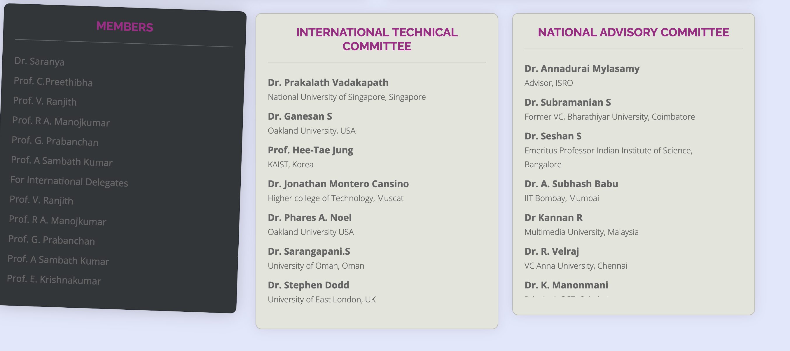

check this [jothis.epizy.com/app_ ](http://jothis.epizy.com/app_)-->on progress working
new app [new chat app](https://63ab2ea5645d9140f42f3694--jothis.netlify.app)--> working -- **which room number????????????????**

## UI Corrections

- decrease the size for hover Organizing Committee Members 
- footer useful links
- send message button in contectus. while hovering it shows red color

### Please check it 
- in ur local
-  if does not have any changes
### do this
- git stash
- git checkout -b test
- git branch -D main
- git checkout -b main --track origin/main

do this you get resent code run this if you not statifies then you should change no problem

- focus on yellow color cards add effects like popup background shadow etc for all that is only pending tast.
-> jothis : added the colors removed the yellow color
-> samithra please take care of overall allsoe

## updated about the new structure
- 1st 4 patials load automatically 
- when every user scroll make a request load data async so it increase speed a lot
- when every adding new partials add in a js too and keep same structure in home as like that
## production link
https://park-conference.000webhostapp.com/
please check

## chat link
pls??????????????????????????
please rechange it :
### do this
- git stash
- git checkout -b test1
- git branch -D main
- git checkout -b main --track origin/main
- now make your change still that mode of payent orangianser not perfect
chat app app in progress i will avaivle in new when you get time have look at it.

## new changes are coming
- add 3 people secaroty before to pricinapal and 2organziers. i will add their names photos
- **not clearly understandable** plz provide more clear information
- i Will take care of this

## check this bugs

- i will take new changes comming near to pricipal photo you make this perfect

